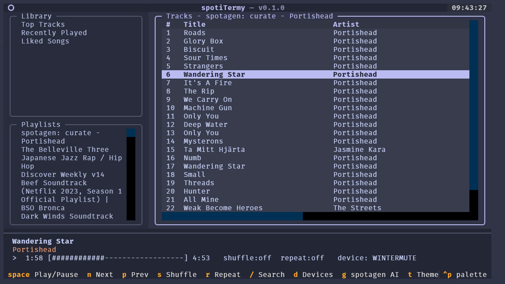

# spotiTermy

A Catppuccin-themed Spotify terminal UI in Python (Textual), inspired by
[spotui](https://github.com/cjbassi/spotui) and integrating
[spotagen]([https://github.com/ms4ndst/spotagen) as an in-app AI playlist menu.



## Features

- 4-pane Textual layout: Library, Playlists, Tracks, Now Playing
- Playback control (play/pause, skip, seek, shuffle, repeat, device pick)
- Spotify search
- **spotagen menu (`g`)**: AI-curated playlists (Claude / OpenAI / Mistral / Ollama)
- Live theme switching across all four Catppuccin flavors (`t`)

## Install

```powershell
cd C:\Users\magnus.sandstrom\Code\Repo\spotiTermy
python -m venv .venv
.venv\Scripts\python -m pip install -e .
```

## Spotify credentials (one-time)

1. Create an app at https://developer.spotify.com/dashboard
2. Add redirect URI: `http://127.0.0.1:8888/callback`
3. Run the app once. It writes a stub config to
   `%APPDATA%\spotitermy\config.toml`. Edit it and fill in `[spotify]`:

```toml
[spotify]
client_id     = "..."
client_secret = "..."
redirect_uri  = "http://127.0.0.1:8888/callback"

[ui]
flavor = "mocha"     # mocha | latte | frappe | macchiato
accent = "mauve"     # mauve | blue | lavender | peach | teal | sky | green

[ai]
provider          = "claude"   # claude | openai | mistral | ollama | none
claude_api_key    = "..."
claude_model      = "claude-sonnet-4-6"
```

Env-var overrides also work: `SPOTIPY_CLIENT_ID`, `SPOTIPY_CLIENT_SECRET`,
`SPOTIPY_REDIRECT_URI`.

## Run

```powershell
spotitermy
# or
python -m spotitermy --flavor latte --accent blue
```

## Playback device

The Spotify Web API can only target a **Spotify Connect** device that is
online AND logged into the same account as spotiTermy. Options:

- The official Spotify desktop / mobile / web app (open it once, then it
  appears in `d`)
- A Spotify-Connect-capable speaker / receiver on your LAN
- A headless daemon — [spotifyd-win](https://github.com/ms4ndst/spotifyd-win)
  on Windows, [spotifyd](https://github.com/Spotifyd/spotifyd) on
  Linux / macOS

### spotifyd-win recipe (Windows, headless)

Recommended: **run foreground at logon**, not as a Windows service. The
service runs in Session 0 which (a) has no audio device access and (b) uses
a `LocalSystem` profile that can't read the OAuth cache you authenticated
into. Foreground at logon sidesteps both.

```powershell
# one-time: cache OAuth credentials in a shared path
.\spotifyd-win.exe authenticate --cache-path "C:\ProgramData\spotifyd-win\cache"

# autostart at logon
$wsh = New-Object -ComObject WScript.Shell
$lnk = $wsh.CreateShortcut("$env:APPDATA\Microsoft\Windows\Start Menu\Programs\Startup\spotifyd-win.lnk")
$lnk.TargetPath = "<path-to>\spotifyd-win.exe"
$lnk.Arguments  = '--cache-path "C:\ProgramData\spotifyd-win\cache"'
$lnk.WindowStyle = 7  # minimised
$lnk.Save()
```

**Account match matters.** spotiTermy will only see Connect devices logged
in as the same Spotify user. Check what account spotiTermy is logged in
as:

```powershell
Get-Content "$env:APPDATA\spotitermy\config.toml" | Select-String username
```

If it doesn't match the user shown in spotifyd-win's log (`Authenticated as
'<user>'`), re-do OAuth as the correct account:

```powershell
Remove-Item "$env:APPDATA\spotitermy\token.cache" -ErrorAction SilentlyContinue
spotitermy   # browser opens, log in with the matching account
```

## Keybindings

| Key   | Action |
|-------|--------|
| Space | Play / Pause |
| n / p | Next / Previous track |
| -> <- | Seek +/- 10s |
| s     | Toggle shuffle |
| r     | Cycle repeat (off / context / track) |
| /     | Search |
| d     | Device picker |
| **g** | **spotagen AI menu** |
| t     | Cycle Catppuccin flavor |
| Tab   | Move between panes |
| q     | Quit |

## Spotagen menu

`g` opens a modal with four modes:

- **Curate** (AI) - pick deeper cuts by your seed artists
- **Discover** (AI) - suggest *new* artists similar to your seeds
- **Genre brief** (AI) - free-form vibe brief ("late-night jazz piano",
  "norwegian black metal", ...)
- **By Spotify genre tag** (no AI) - direct Spotify search for artists
  tagged with a multi-word genre (e.g. `dream pop`, `shoegaze`). Works
  without any AI provider configured. The query is quoted so multi-word
  tags match the filter instead of leaking into free-text search.

Suggestions are resolved against Spotify search and added to a new playlist.
The first three modes need an AI provider configured in `[ai]`; the
genre-tag mode does not.

## Theme

All colors come from the official Catppuccin palette (see `spotitermy/theme.py`).
Each color is applied by **role** (Base / Surface / Text / Accent / etc.),
never by raw hex value, so switching flavor at runtime is a single lookup.

### Valid `[ui]` values

Pick one `flavor` and one `accent`. All 4 × 7 = 28 combinations are valid.

```toml
[ui]
flavor = "mocha"     # mocha | latte | frappe | macchiato
accent = "mauve"     # mauve | blue | lavender | peach | teal | sky | green
```

| Flavor      | When to pick it                                  |
|-------------|--------------------------------------------------|
| `mocha`     | Default. Deepest contrast dark mode.             |
| `macchiato` | Medium dark — slightly less contrast than Mocha. |
| `frappe`    | Warm dark — easier on the eyes for long sessions.|
| `latte`     | Light mode — daytime / bright environments.      |

The accent color drives focus borders, the header text, active list
selection, primary buttons, and progress fill. Hex per (flavor × accent):

| Accent     | Mocha     | Latte     | Frappe    | Macchiato |
|------------|-----------|-----------|-----------|-----------|
| `mauve`    | `#cba6f7` | `#8839ef` | `#ca9ee6` | `#c6a0f6` |
| `blue`     | `#89b4fa` | `#1e66f5` | `#8caaee` | `#8aadf4` |
| `lavender` | `#b4befe` | `#7287fd` | `#babbf1` | `#b7bdf8` |
| `peach`    | `#fab387` | `#fe640b` | `#ef9f76` | `#f5a97f` |
| `teal`     | `#94e2d5` | `#179299` | `#81c8be` | `#8bd5ca` |
| `sky`      | `#89dceb` | `#04a5e5` | `#99d1db` | `#91d7e3` |
| `green`    | `#a6e3a1` | `#40a02b` | `#a6d189` | `#a6da95` |

`t` cycles the flavor at runtime (mocha → macchiato → frappe → latte → mocha).
Accent is config-only — change it in `config.toml` and restart.

You can also override per run:

```powershell
spotitermy --flavor latte --accent blue
spotitermy --flavor frappe --accent peach
```

CLI overrides do not persist; they affect only that session.

## Spotify Web API

Endpoints used follow the documentation in `ref/spotify-web-api.md`:
Authorization Code Flow with PKCE-safe token cache, scopes for playback +
library + playlist read/modify, retry-respecting `Retry-After` via spotipy.

## Troubleshooting

| Symptom | Cause | Fix |
|---|---|---|
| Device picker empty | No Connect device online for your account | Open Spotify desktop / mobile, or start spotifyd-win |
| Picker shows spotifyd but pressing a track does nothing visible | Hit a transient state - spotiTermy now surfaces the error toast on next attempt | Press `d`, pick the device explicitly, retry |
| `403 Restriction violated` toast | Spotify Free can't be driven via the Web API | Premium account required for remote playback control |
| `404 NO_ACTIVE_DEVICE` even after picking | Stale device id - the daemon restarted with a new id | Press `d` again to refresh |
| Service-mode spotifyd-win silent | Session 0 isolation + LocalSystem cache | Use the foreground-at-logon recipe above |
